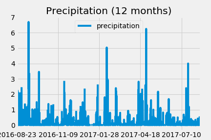

In this project I had to plan a trip to Honolulu, Hawaii! Before planning the trip a climate analysis of the area was required. 

Python and SQLAlchemy will be used to conduct a basic climate analysis and data exploration of the climate database. All of the following analysis will be completed using SQLAlchemy ORM queries, Pandas, and Matplotlib.

  

    

    

  

### Copyright

Trilogy Education Services © 2019. All Rights Reserved.
